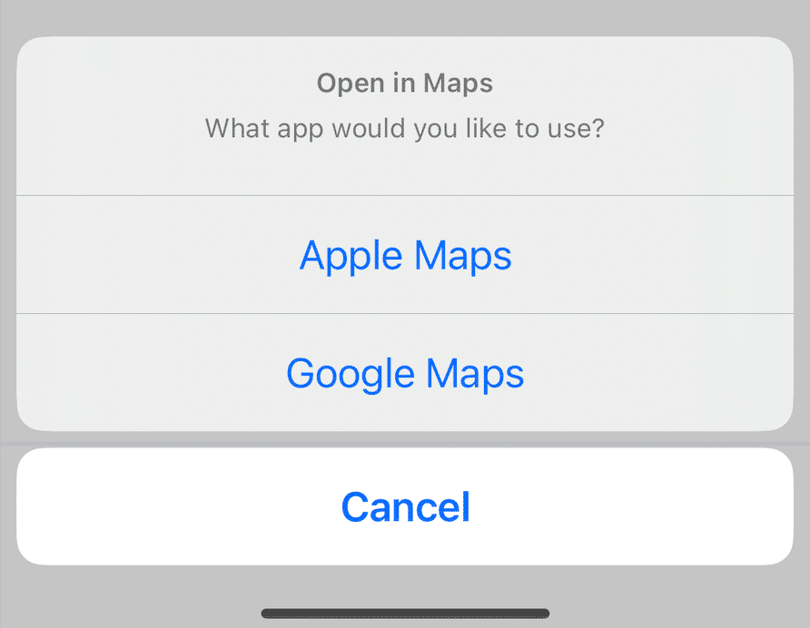
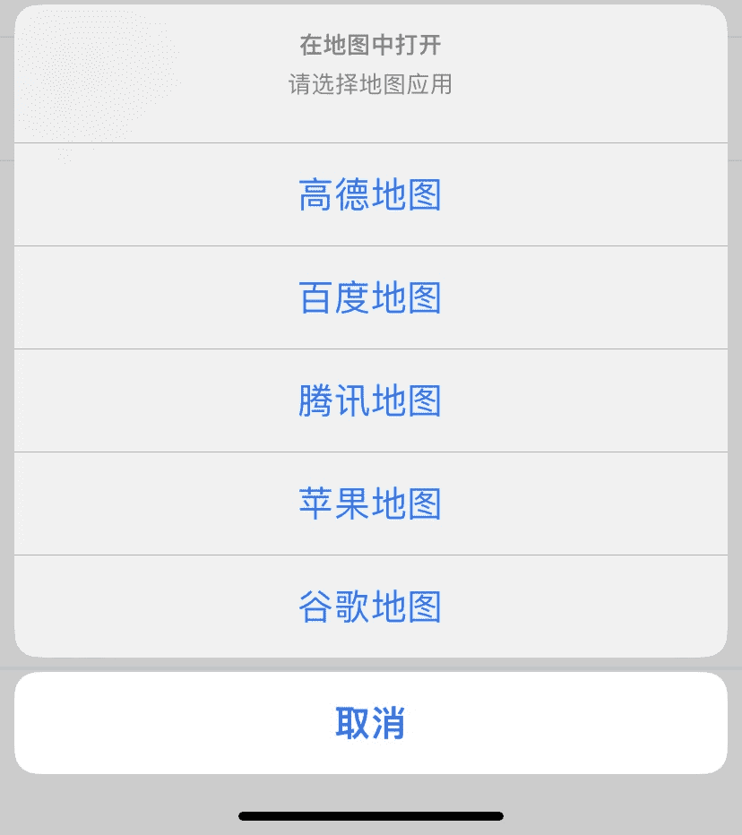
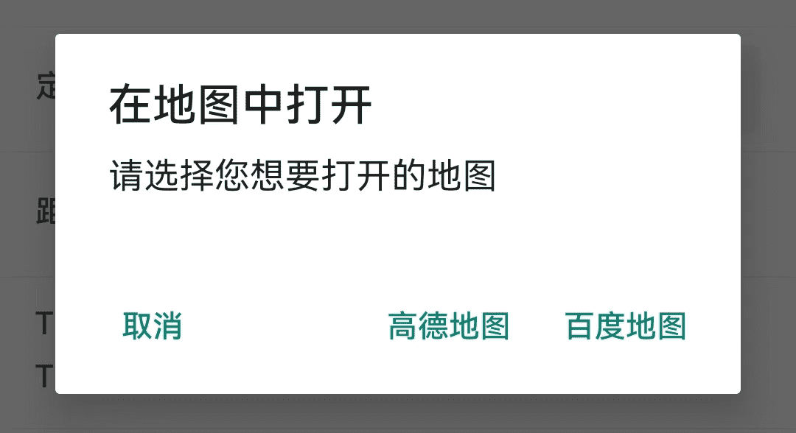
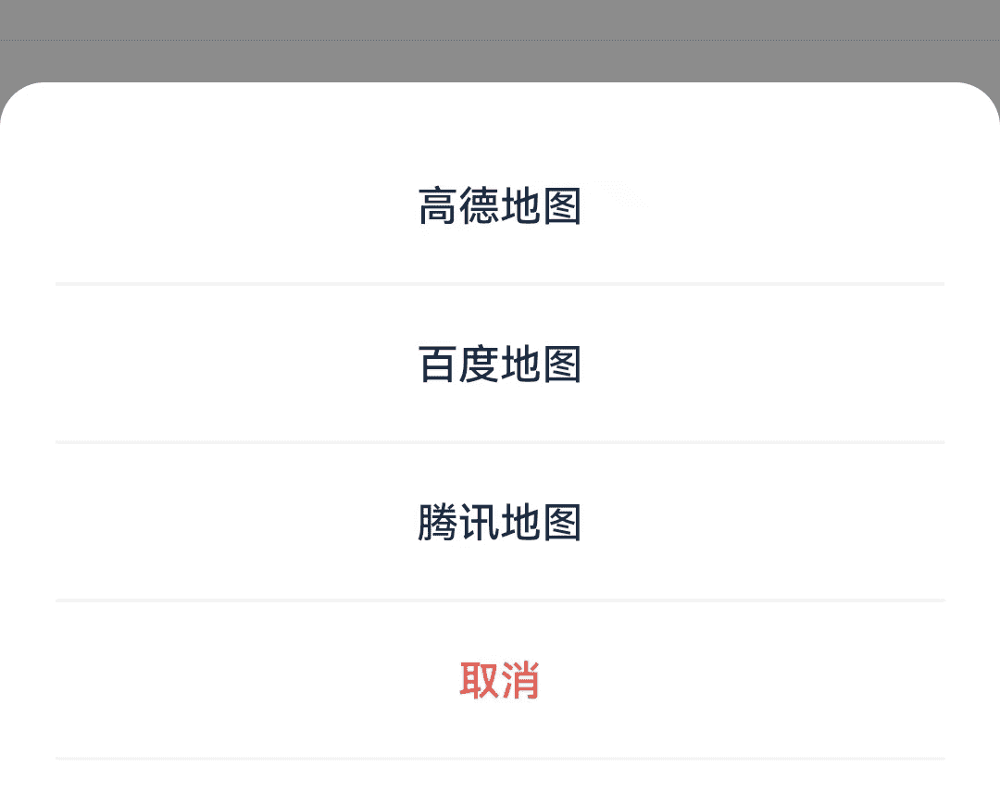

# react-native-map-link-x

<div style="display: none">
[](https://www.npmjs.com/package/react-native-map-link-x)
[](https://www.npmjs.com/package/react-native-map-link-x)
[](https://github.com/flexible-agency/react-native-map-link-x/blob/master/LICENSE)


---
</div>

An easy way to open a location in a map app of the user's choice, based on the apps they have installed
on their device. The app supports Apple Maps, Google Maps, Citymapper, Uber and a dozen other apps.

This is fork from [react-native-map-link](https://github.com/christopherdro/react-native-map-link). Based on the original library, it adds support for `Gaode Maps`, `Baidu Maps`, and `Tencent Maps`. Additionally, it resolves the issue where some devices, are unable to recognize map apps, such as Huawei.

---

根据用户设备中已安装的地图应用，提供一种便捷方式，打开用户所选的定位导航。支持苹果地图、谷歌地图、优步，以及其他国外主流地图应用。

本库 Fork 自 [react-native-map-link](https://github.com/christopherdro/react-native-map-link)，在原库的基础上，添加对`高德地图`、`百度地图`、`腾讯地图`的支持。另外，解决部分 Android 设备无法识别地图应用的问题，如华为手机等。

<details>
<summary><strong>Full list of supported apps</strong></summary>

- Gaode Maps – `amap`
- Baidu Maps – `baidumap`
- Tencent Maps – `qqmap`
- Apple Maps – `apple-maps`
- Google Maps – `google-maps`
- Citymapper – `citymapper`
- Uber – `uber`
- Lyft – `lyft`
- The Transit App – `transit`
- TruckMap – `truckmap`
- Waze – `waze`
- Yandex.Navi – `yandex`
- Moovit – `moovit`
- Yandex Taxi – `yandex-taxi`
- Yandex Maps – `yandex-maps`
- Kakao Map – `kakaomap`
- TMAP - `tmap`
- Mapy.cz – `mapycz`
- Maps.me – `maps-me`
- OsmAnd - `osmand`
- Gett - `gett`
- Naver Map - `navermap`
- 2GIS - `dgis`
- Liftago - `liftago`
- Petal Maps - `petalmaps` (Android only)
- Sygic - `sygic`

</details>

<br /><p align="center">




</p>

## Installation

### 1. Install the package

```shell
npm i -S react-native-map-link-x
# or
yarn add react-native-map-link-x
```

### 2. Post-install steps

Based on the platforms your app supports, you also need to:

**注意：**
- 切记更新 iOS 和 Android 配置，否则将无法调起地图应用；
- 仅在中国使用的话，可以剔除大部分国外地图应用，保留 `iosamap`、`androidmap`、`baidumap`、`qqmap`；
- 繁体中文地区，支持显示繁体，但未经过实地测试，欢迎参与测试。

<details id="iOSPostInstall">
<summary><strong>iOS – Update Info.plist</strong></summary>

To allow your app to detect if any of the directions apps are installed, an extra step is required on iOS. Your app needs to provide the `LSApplicationQueriesSchemes` key inside `ios/{my-project}/Info.plist` to specify the URL schemes with which the app can interact.

Just add this in your `Info.plist` depending on which apps you'd like to support. Omitting these might mean that the library can't detect some of the maps apps installed by the user.

```xml
<key>LSApplicationQueriesSchemes</key>
<array>
    <string>iosamap</string>
    <string>androidamap</string>
    <string>baidumap</string>
    <string>qqmap</string>
    <string>comgooglemaps</string>
    <string>citymapper</string>
    <string>uber</string>
    <string>lyft</string>
    <string>transit</string>
    <string>truckmap</string>
    <string>waze</string>
    <string>yandexnavi</string>
    <string>moovit</string>
    <string>yandextaxi</string>
    <string>yandexmaps</string>
    <string>kakaomap</string>
    <string>tmap</string>
    <string>szn-mapy</string>
    <string>mapsme</string>
    <string>osmandmaps</string>
    <string>gett</string>
    <string>nmap</string>
    <string>dgis</string>
    <string>lftgpas</string>
    <string>sygic</string>
</array>
```

Using Expo? [Read the instructions](docs/expo.md) to make it work on iOS.

</details>

<details id="androidPostInstall">
<summary><strong>Android – Update AndroidManifest.xml</strong></summary>

When switching to Android 11/Android SDK 30 (i.e. using Expo SDK 41), this library doesn't work out of the box anymore. The reason is the new [Package Visibilty](https://developer.android.com/training/package-visibility) security feature. We'll have to update our `AndroidManifest.xml` to explicitly allow querying for other apps.

You can do so by coping the `<queries>` statement below, and pasting it in the top level of your AndroidManifest (i.e. within the `<manifest> ... </manifest>`).

```xml
<queries>
  <intent>
    <action android:name="android.intent.action.VIEW" />
    <data android:scheme="http"/>
  </intent>
  <intent>
    <action android:name="android.intent.action.VIEW" />
    <data android:scheme="https"/>
  </intent>
  <intent>
    <action android:name="android.intent.action.VIEW" />
    <data android:scheme="geo" />
  </intent>
  <intent>
    <action android:name="android.intent.action.VIEW" />
    <data android:scheme="androidamap"/>
  </intent>
  <intent>
    <action android:name="android.intent.action.VIEW" />
    <data android:scheme="baidumap"/>
    <data android:host="map"/>
  </intent>
  <intent>
    <action android:name="android.intent.action.VIEW" />
    <data android:scheme="qqmap"/>
  </intent>
  <intent>
    <action android:name="android.intent.action.VIEW" />
    <data android:scheme="google.navigation" />
  </intent>
  <intent>
    <action android:name="android.intent.action.VIEW" />
    <data android:scheme="applemaps" />
  </intent>
  <intent>
    <action android:name="android.intent.action.VIEW" />
    <data android:scheme="citymapper" />
  </intent>
  <intent>
    <action android:name="android.intent.action.VIEW" />
    <data android:scheme="uber" />
  </intent>
  <intent>
    <action android:name="android.intent.action.VIEW" />
    <data android:scheme="lyft" />
  </intent>
  <intent>
    <action android:name="android.intent.action.VIEW" />
    <data android:scheme="transit" />
  </intent>
  <intent>
    <action android:name="android.intent.action.VIEW" />
    <data android:scheme="truckmap" />
  </intent>
  <intent>
    <action android:name="android.intent.action.VIEW" />
    <data android:scheme="waze" />
  </intent>
  <intent>
    <action android:name="android.intent.action.VIEW" />
    <data android:scheme="yandexnavi" />
  </intent>
  <intent>
    <action android:name="android.intent.action.VIEW" />
    <data android:scheme="moovit" />
  </intent>
  <intent>
    <action android:name="android.intent.action.VIEW" />
    <data android:scheme="yandexmaps://maps.yandex." />
  </intent>
  <intent>
    <action android:name="android.intent.action.VIEW" />
    <data android:scheme="yandextaxi" />
  </intent>
  <intent>
    <action android:name="android.intent.action.VIEW" />
    <data android:scheme="kakaomap" />
  </intent>
    <intent>
    <action android:name="android.intent.action.VIEW" />
    <data android:scheme="tmap" />
  </intent>
  <intent>
    <action android:name="android.intent.action.VIEW" />
    <data android:scheme="mapycz" />
  </intent>
  <intent>
    <action android:name="android.intent.action.VIEW" />
    <data android:scheme="mapsme" />
  </intent>
  <intent>
    <action android:name="android.intent.action.VIEW" />
    <data android:scheme="osmand.geo" />
  </intent>
  <intent>
    <action android:name="android.intent.action.VIEW" />
    <data android:scheme="gett" />
  </intent>
  <intent>
    <action android:name="android.intent.action.VIEW" />
    <data android:scheme="nmap" />
  </intent>
  <intent>
    <action android:name="android.intent.action.VIEW" />
    <data android:scheme="dgis" />
  </intent>
  <intent>
    <action android:name="android.intent.action.VIEW" />
    <data android:scheme="lftgpas" />
  </intent>
  <intent>
    <action android:name="android.intent.action.VIEW" />
    <data android:scheme="petalmaps" />
  </intent>
  <intent>
    <action android:name="android.intent.action.VIEW" />
    <data android:scheme="com.sygic.aura" />
  </intent>
</queries>
```

If you're running into a 'unexpected element `<queries>` found in `<manifest>`' error, make sure you have an updated version of Gradle in your `android/build.gradle` file:

```java
classpath("com.android.tools.build:gradle:3.5.4")
```

More info [here](https://stackoverflow.com/a/67383641/1129689).

</details>

<details>
<summary><strong>Expo – Update app.json</strong></summary>

[Read the instructions here](docs/expo.md)

</details>

## Simple example

```js
import { showLocation } from 'react-native-map-link-x';

showLocation({
  latitude: 38.8976763,
  longitude: -77.0387185,
  title: 'Your destination',
});
```

## Chinese example

使用默认组件显示地图应用列表：

```js
import { showLocation } from 'react-native-map-link-x';

// 弹出默认地图应用列表
showLocation({
  latitude: 24.436048,
  longitude: 118.088061,
  title: '世贸海峡大厦',
  address: '厦门市思明区演武西路180-188号',
  dialogTitle: '在地图中打开',
  dialogMessage: '请选择您想要打开的地图',
  cancelText: '取消',
  appsWhiteList: ['apple-maps', 'amap', 'baidumap', 'qqmap'],
});
```
使用第三方 ActionSheet 组件显示地图应用列表：

```js
import { getApps } from 'react-native-map-link-x';
// 引入第三方 ActionSheet 组件
import { useActionSheet } from '@expo/react-native-action-sheet';

...

const { showActionSheetWithOptions } = useActionSheet();

// 获取可用的地图应用列表
const apps = await getApps({
  latitude: 24.436048,
  longitude: 118.088061,
  title: '世贸海峡大厦',
  address: '厦门市思明区演武西路180-188号',
  dialogTitle: '在地图中打开',
  dialogMessage: '请选择您想要打开的地图',
  cancelText: '取消',
  appsWhiteList: ['apple-maps', 'amap', 'baidumap', 'qqmap'],
});

// 通过第三方 ActionSheet 组件显示地图应用列表
showActionSheetWithOptions({
  options: apps.map((app) => app.name).push('取消'),
}, {
  onPress: (index) => {
    const app = apps[index];
    app?.open();
  }
});
```


## Full usage

Using the `showLocation` function will shown an action sheet on iOS and an alert on Android, without any custom styling:

```js
import { showLocation } from 'react-native-map-link-x';

showLocation({
  latitude: 38.8976763,
  longitude: -77.0387185,
  sourceLatitude: -8.0870631, // optionally specify starting location for directions
  sourceLongitude: -34.8941619, // required if sourceLatitude is specified
  title: 'The White House', // optional 
  googleForceLatLon: false, // optionally force GoogleMaps to use the latlon for the query instead of the title
  googlePlaceId: 'ChIJGVtI4by3t4kRr51d_Qm_x58', // optionally specify the google-place-id
  alwaysIncludeGoogle: true, // optional, true will always add Google Maps to iOS and open in Safari, even if app is not installed (default: false)
  dialogTitle: 'This is the dialog Title', // optional (default: 'Open in Maps')
  dialogMessage: 'This is the amazing dialog Message', // optional (default: 'What app would you like to use?')
  cancelText: 'This is the cancel button text', // optional (default: 'Cancel')
  appsWhiteList: ['amap', 'baidumap', 'qqmap'], // optionally you can set which apps to show (default: will show all supported apps installed on device)
  naverCallerName: 'com.example.myapp', // to link into Naver Map You should provide your appname which is the bundle ID in iOS and applicationId in android.
  appTitles: {'google-maps': 'My custom Google Maps title'}, // optionally you can override default app titles
  app: 'uber', // optionally specify specific app to use
  directionsMode: 'walk', // optional, accepted values are 'car', 'walk', 'public-transport' or 'bike'
});
```

Alternatively you can specify the `address` field and leave the latitude and longitude properties as empty strings 

```js
import { showLocation } from 'react-native-map-link-x';

showLocation({
  address: '1600 Pennsylvania Avenue NW, Washington, DC 20500', // Required if replacing latitude and longitude
  app: 'comgooglemaps',  // optionally specify specific app to use
});
```

Notes:

- The `sourceLatitude` / `sourceLongitude` options only work if you specify both. Currently supports all apps except Waze.
- `directionsMode` works on google-maps, apple-maps and sygic (on apple-maps, `bike` mode will not work, while on sygic, only `walk` and `car` will work). Without setting it, the app will decide based on its own settings.
- If you set `directionsMode` but do not set `sourceLatitude` and `sourceLongitude`, google-maps and apple-maps will still enter directions mode, and use the current location as starting point.
- If you want to query an address instead of passing the `latitude` and `longitude` fields, you can do this by leaving those fields off and provide a full address to be queried with the `address` field. Just be aware that not all applications support this.

### Or

Using the `getApps` function will return an array (`GetAppResult[]`) with the apps available on the smartphone:

```ts
type GetAppResult = {
  id: string;
  name: string;
  icon: NodeRequire;
  open: () => Promise<void>;
};
```

```tsx
import { getApps, GetAppResult } from 'react-native-map-link-x';

const Demo = () => {
  const [availableApps, setAvailableApps] = useState<GetAppResult[]>([]);

  useEffect(() => {
    (async () => {
      const result = await getApps({
        latitude: 38.8976763,
        longitude: -77.0387185,
        address: '1600 Pennsylvania Avenue NW, Washington, DC 20500', // optional 
        title: 'The White House', // optional
        googleForceLatLon: false, // optionally force GoogleMaps to use the latlon for the query instead of the title
        alwaysIncludeGoogle: true, // optional, true will always add Google Maps to iOS and open in Safari, even if app is not installed (default: false)
        appsWhiteList: ['google-maps'], // optionally you can set which apps to show (default: will show all supported apps installed on device)
      });
      setAvailableApps(result);
    })();
  }, []);

  return (
    <React.Fragment>
      {availableApps.map(({icon, name, id, open}) => (
        <Pressable key={id} onPress={open}>
          <Image source={icon} />
          <Text>{name}</Text>
        </Pressable>
      ))}
    </React.Fragment>
  );
};
```

## More information

- [Using this library with Expo](docs/expo.md)
- [Alternative usage: styled popup](docs/popup.md)
- [Adding support for new maps apps](docs/add-app.md)

<br /><br />

---

<div align="center">
	<b>
		<a href="https://schof.co/consulting/?utm_source=flexible-agency/react-native-map-link">Get professional support for this package →</a>
	</b>
	<br>
	<sub>
		Custom consulting sessions available for implementation support or feature development.
	</sub>
</div>
